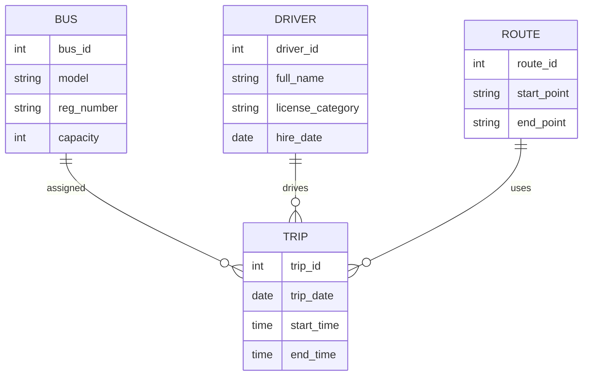
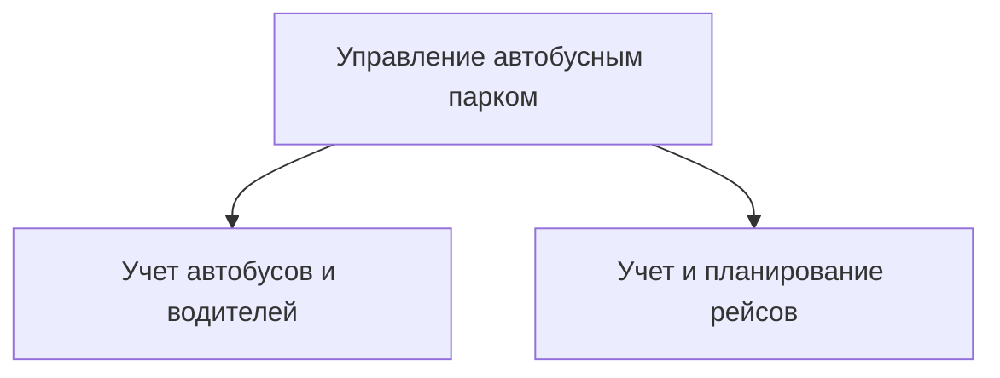
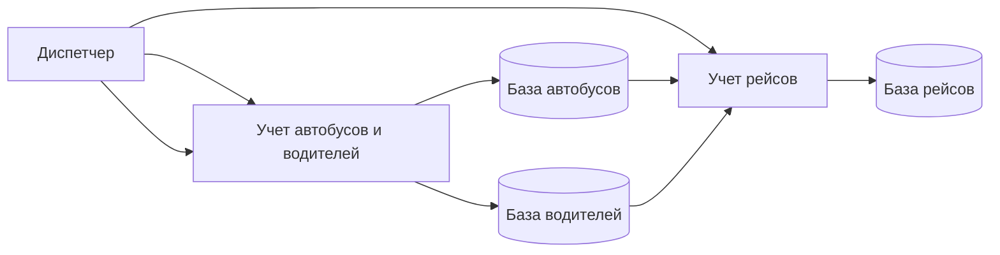
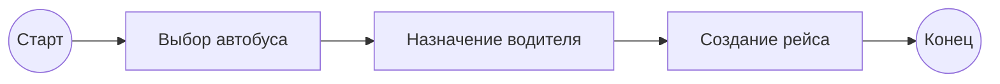
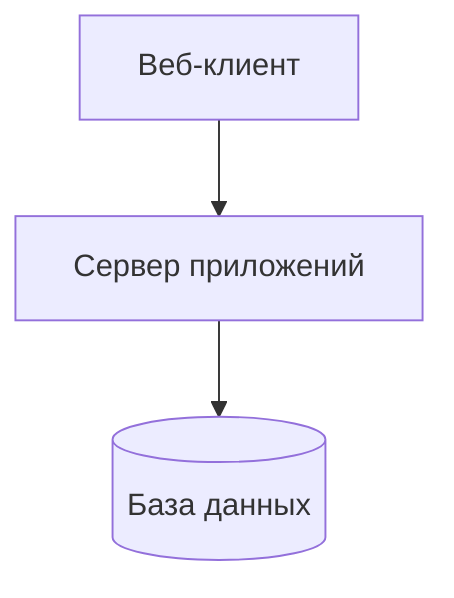

# Информационная система «Автобусный парк»

## 1. Предметная область

**Автобусный парк** — система учета и управления подвижным составом, водителями и ежедневными рейсами.

### Решаемые задачи

* учет автобусов;
* учет водителей;
* ежедневный учет рейсов:

  * номер рейса;
  * номер автобуса;
  * табельный номер водителя;
  * конечные пункты;
  * время начала и окончания работы водителя.

---

## 2. Вербальное описание

Система предназначена для автоматизации деятельности автобусного парка. Она обеспечивает хранение данных об автобусах и водителях, формирование и учет ежедневных рейсов, контроль загрузки водителей и подвижного состава, а также предоставление отчетности для диспетчеров и руководства.

Основные пользователи системы:

* диспетчер;
* администратор парка;
* руководство.

---

## 3. ER-диаграмма (нотация Чена)



---

## 4. Контекстная диаграмма (IDEF0, уровень C2)

```mermaid
flowchart LR
    Dispatcher[Диспетчер]
    Management[Руководство]
    System[ИС "Автобусный парк"]

    Dispatcher -->|Данные о рейсах| System
    System -->|Отчеты| Management
    System -->|Расписания| Dispatcher
```

---

## 5. Диаграмма декомпозиции функций (IDEF0, до A2)



---

## 6. Диаграмма потоков данных (Гейна–Сарсона, до A2)



---

## 7. BPMN-диаграмма процесса «Формирование рейса»



---

## 8. Архитектура системы (ГОСТ 57100)

**Тип архитектуры:** клиент–серверная, модульная.

### Основные компоненты:

* пользовательский интерфейс (веб-клиент);
* сервер приложений (бизнес-логика);
* база данных;
* модуль отчетности.



---

## 9. Принципы функционирования

* целостность и непротиворечивость данных;
* разграничение прав доступа;
* централизованное хранение информации;
* трассируемость операций.

---

## 10. Принципы развития

* модульность и расширяемость;
* масштабируемость по количеству рейсов и пользователей;
* возможность интеграции с внешними системами (GPS, билеты);
* поддержка обновлений без остановки системы.

---

## 11. Методики испытания и тестирования сервиса

### Виды тестирования:

* модульное тестирование;
* интеграционное тестирование;
* функциональное тестирование;
* нагрузочное тестирование;
* приемочные испытания.

### Основные проверки:

* корректность учета рейсов;
* недопущение назначения одного водителя на пересекающиеся рейсы;
* формирование отчетов;
* устойчивость системы при пиковых нагрузках.

---

**Документ подготовлен в формате Markdown с использованием графических диаграмм.**
